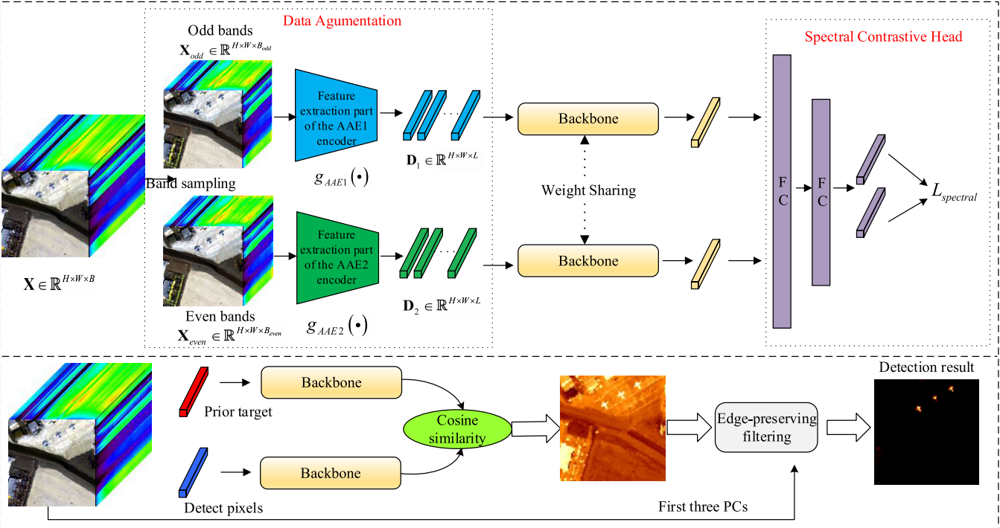

# SCLHTD

## Self-Supervised Spectral-Level Contrastive Learning for Hyperspectral Target Detection(TGRS2023)

Paper web page: [Self-Supervised Spectral-Level Contrastive Learning for Hyperspectral Target Detection](https://ieeexplore.ieee.org/document/10108046).



# Abstract:

<p style="text-align: justify;">
    Deep learning-based hyperspectral target detection (HTD) methods are limited by the lack of prior information. Self-supervised learning is a kind of unsupervised learning, which mainly mines its own self-supervised information from unlabeled data. By training the model with such constructed valid posterior information, a valuable representation model can be learned and can get rid of the dependence of deep models on prior information. To this end, this article proposes a self-supervised spectral-level contrastive learning-based HTD (SCLHTD) method to train a model with spectral difference discrimination capability for HTD in a self-supervised manner. First, the hyperspectral images (HSIs) to be detected are sampled in odd and even bands, and the obtained band subsets are then used to train the corresponding adversarial convolutional autoencoders. Feature extraction part of the trained encoder is then used as the data augmentation function, where the positive and negative pairs are constructed through data augmentation, and the backbone is used to extract the representative vectors of the augmented samples. Second, the representative vectors are mapped to the spectral contrast space using spectral contrastive head, where the similarity and dissimilarity of spectra are learned by maximizing the similarity of positive pairs while minimizing the similarity of negative pairs, so that the backbone can discriminate spectral differences. Finally, aiming at suppressing the background, edge-preserving filters are used in conjunction with space information to process the detection results acquired by utilizing spectrum information via cosine similarity to generate the final detection results. Experimental results illustrate that the proposed SCLHTD method can achieve superior performances for HTD.
</p>


# Citations:

If you find the code helpful in your research or work, please cite the following paper:

```
@ARTICLE{10108046,
  author={Wang, Yulei and Chen, Xi and Zhao, Enyu and Song, Meiping},
  journal={IEEE Transactions on Geoscience and Remote Sensing}, 
  title={Self-Supervised Spectral-Level Contrastive Learning for Hyperspectral Target Detection}, 
  year={2023},
  volume={61},
  number={},
  pages={1-15},
  keywords={Feature extraction;Convolution;Adaptation models;Object detection;Detectors;Training;Hyperspectral imaging;Contrastive learning;deep learning;hyperspectral imagery;self-supervised learning;target detection},
  doi={10.1109/TGRS.2023.3270324}}
```

# Requirements：

```
1. Python 3.8.3
2. PyTorch 1.60
3. NVIDIA GPU + CUDA
```

# Usage:

```
1. Run main_sclhtd.py for model training
2. Run detection.py for target detection
```
